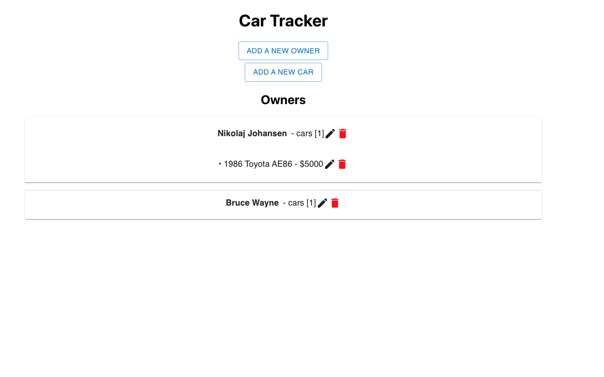

# Car Tracker

Car tracker is an application that lets you keep track of all the vehicles you have out in circulation, their value, and who is currently operating it.

The backend of the applications is built with Ruby on Rails and the front end is React.

# Starting up React

Navigate to the react-front-end directory and run:

#### `npm install`

#### `npm start`

This runs the app in the development mode.\
Open [http://localhost:3001](http://localhost:3001) to view it in the browser.

# Starting up Ruby on Rails

Navigate to rails-api directory and run:

#### `rails bundle`

#### `rails db:migrate`

#### `rails server`

Runs the api in the development mode. There are 2 end points set up:

1. Open [http://localhost:3000/cars](http://localhost:3000/cars) to view it in the browser.
2. Open [http://localhost:3000/people](http://localhost:3000/people) to view it in the browser.

#

